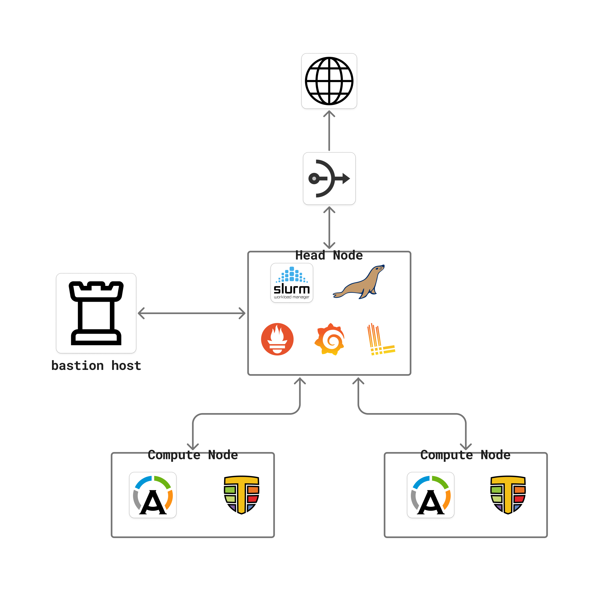
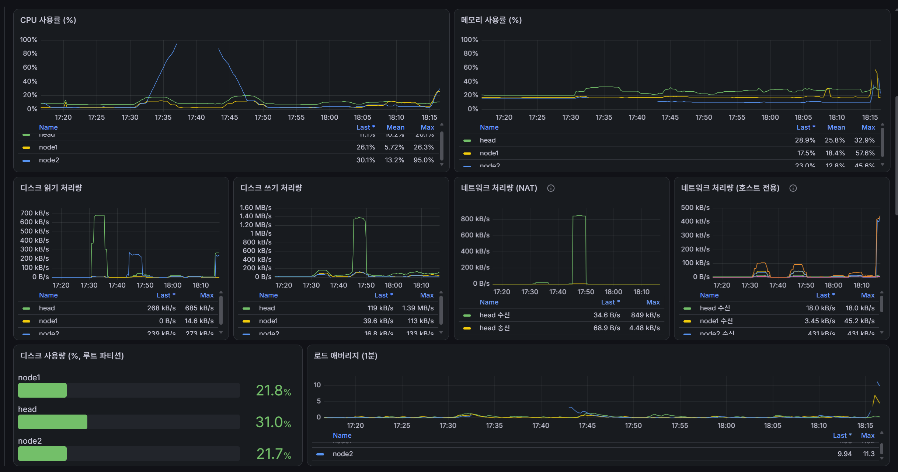
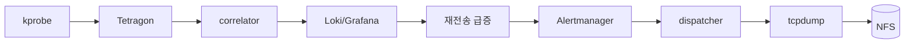
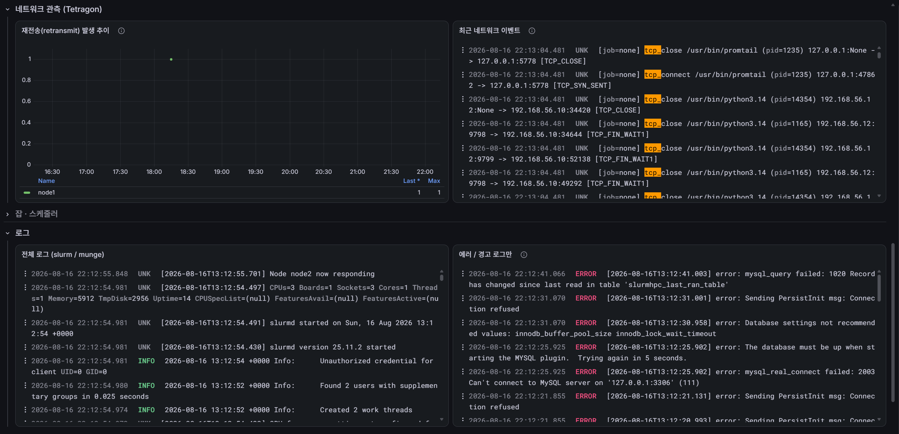
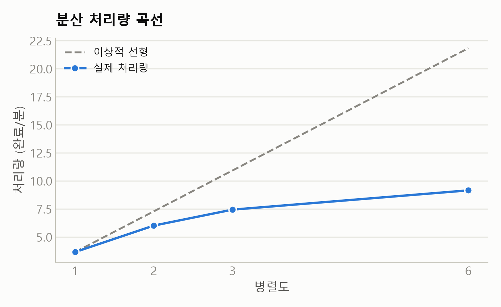
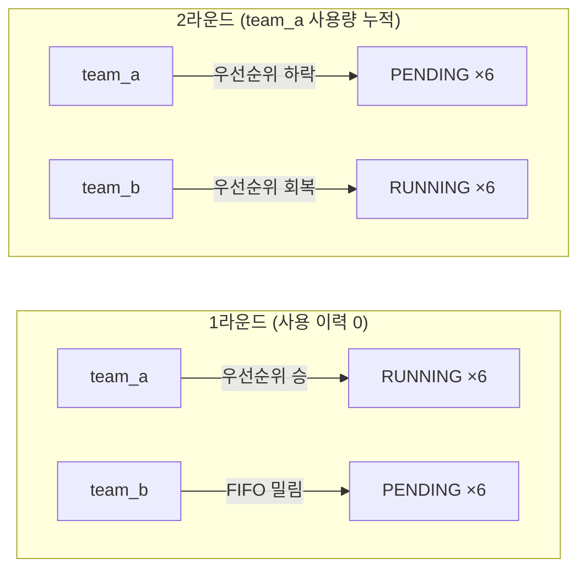
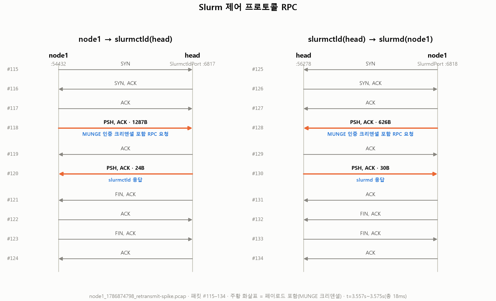
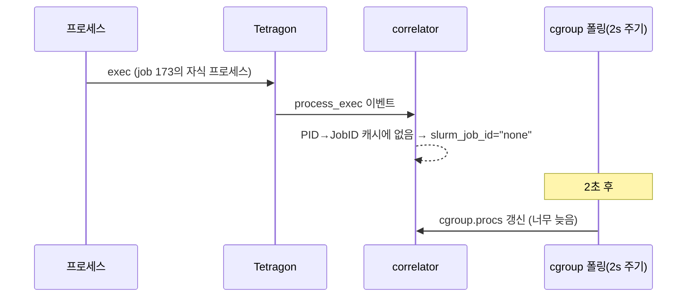
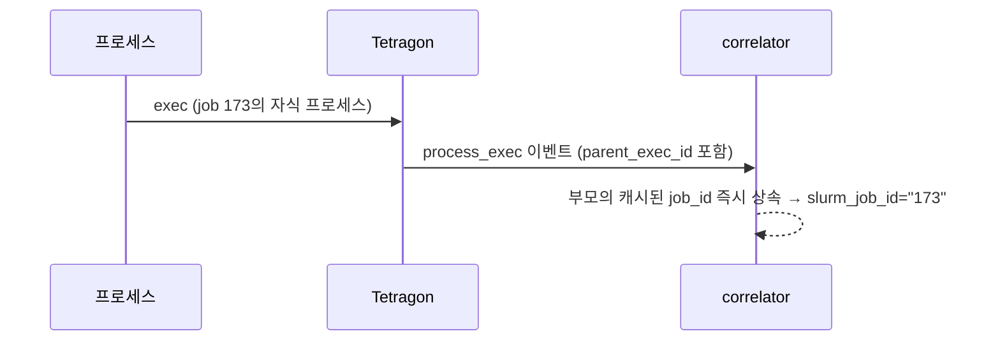
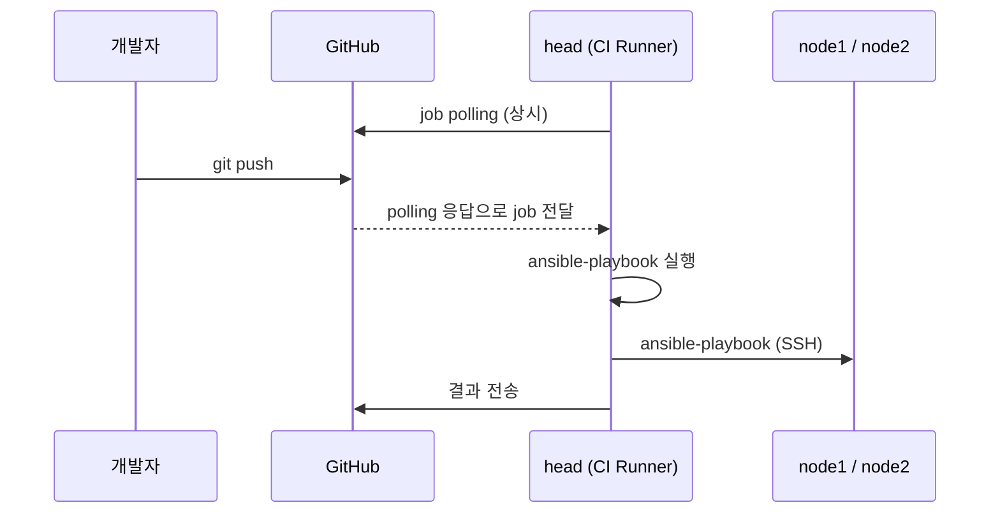

# 🖥️ Slurm HPC Cluster

3개 노드 Slurm 기반 HPC 클러스터를 Ansible로 구축하고, 부하를 걸어 스케줄러·스토리지·관측성·장애 복구까지 검증한 인프라 프로젝트입니다.

> **Note:** 이 저장소는 코드가 아니라 물리 인프라를 관리합니다 — `main`에 push하면 GitHub Actions를 통해 self-hosted CI 러너가 `ansible-playbook site.yml`을 실제 클러스터에 적용합니다.

*빠르게 보려면 → [핵심 기능](#features)*


---

## 목차

1. [클러스터 아키텍처](#architecture)
2. [핵심 기능](#features)
3. [테스트 시나리오](#load-test)
4. [트러블슈팅](#troubleshooting)
5. [CI/CD 파이프라인](#cicd)
6. [기술 스택](#tech-stack)
7. [디렉터리 구조](#directory)
8. [관련 레포지토리](#related)

---

<a id="architecture"></a>

## 🏗️ 1. 클러스터 아키텍처



| 노드 | 역할 | 스펙 | IP |
|---|---|---|---|
| head | Slurm 제어, DB, 공유 스토리지, 관측성 스택, CI 러너 | 4 vCPU / 6GB RAM / 50GB | 192.168.56.10 |
| node1 | 워커(연산 노드) | 3 vCPU / 6.5GB RAM / 25GB | 192.168.56.11 |
| node2 | 워커(연산 노드) | 3 vCPU / 6.5GB RAM / 25GB | 192.168.56.12 |

---

<a id="features"></a>

## ⚙️ 2. 핵심 기능

<a id="feature-slurm"></a>
<details>
<summary><strong>🧮 2-1. Slurm 스케줄러 코어</strong></summary>
<br>

```conf
# slurm.conf
ProctrackType=proctrack/cgroup
JobAcctGatherType=jobacct_gather/cgroup
PriorityType=priority/multifactor
PriorityWeightFairshare=100000

# cgroup.conf
ConstrainCores=yes
ConstrainRAMSpace=yes
ConstrainSwapSpace=yes
```

요청량을 초과하면 cgroup이 OOM으로 강제 종료하고, 같은 노드의 다른 잡은 영향받지 않습니다. fair-share가 실제로 사용량에 따라 우선순위를 바꾸는 동작은 [3-3](#load-test-fairshare)에서 실측했습니다.

</details>

<a id="feature-apptainer"></a>
<details>
<summary><strong>📦 2-2. Apptainer 실행 환경</strong></summary>
<br>

```text
apptainer=1.4.5-1, squashfuse, fuse2fs, uidmap   # 언프리빌리지드 SIF 마운트
```

root 데몬 없이 동작합니다. AppArmor로 userns 제한을 풀어야 하는데, 시스템 전체가 아니라 `apptainer` 바이너리 하나에만 프로필을 걸어 우회 범위를 좁혔습니다.

</details>

<a id="feature-workload"></a>
<details>
<summary><strong>🚀 2-3. 워크로드 배포 자동화</strong></summary>
<br>

```yaml
# workload/optuna_gru/workload.yml
name: optuna_gru
def_file: optuna_gru.def
```

이 매니페스트가 있는 디렉터리만 자동으로 발견되어 배포됩니다. `.def` 해시가 바뀔 때만 컨테이너 이미지를 재빌드하고, 런타임 산출물이 쌓이는 `data/`는 재배포해도 지우지 않습니다(`delete: false`). 워크로드 추가 절차가 "디렉터리 + 매니페스트 하나"로 고정됩니다.

</details>

<a id="feature-observability"></a>
<details>
<summary><strong>📊 2-4. 관측성 스택</strong></summary>
<br>



Prometheus + Grafana + Loki + Alertmanager, 전부 Docker Compose. 노드 리소스, Slurm 큐 상태, 잡별 cgroup 사용률까지 한 대시보드에서 보고, 알림은 severity 기준으로 라우팅해 이메일로 보냅니다.

</details>

<a id="feature-netobs"></a>
<details>
<summary><strong>📡 2-5. eBPF 네트워크 관측 & 재전송 자동 캡처</strong></summary>
<br>



Tetragon이 TCP 이벤트를 후킹하고, exec 체인을 따라 Slurm Job ID까지 귀속합니다. 재전송이 2분 내 5회를 넘으면 Alertmanager가 대상 노드에서 20초간 tcpdump를 돌려 pcap을 NFS로 회수합니다.



</details>

<a id="feature-backup"></a>
<details>
<summary><strong>💽 2-6. DB 백업 자동화</strong></summary>
<br>

```bash
mariadb-dump -u root --all-databases --routines --events | gzip > "$OUT_FILE"
```

매일 자동 백업하고, 백업 시각·크기를 Prometheus 메트릭(`mariadb_backup_last_success_timestamp_seconds`, `mariadb_backup_last_size_bytes`)으로 노출해서 "조용히 실패하는 백업"이 없게 했습니다.


</details>

---

<a id="load-test"></a>

## 🧪 3. 테스트 시나리오

부하는 GRU 시퀀스 모델 + Optuna 하이퍼파라미터 튜닝으로 겁니다.

<a id="load-test-storage"></a>
<details>
<summary><strong>💾 3-1. 스토리지 백엔드 비교 — SQLite(NFS) vs MariaDB</strong></summary>
<br>

Optuna storage를 NFS 위 SQLite 파일로 줬을 때와 MariaDB로 줬을 때를 동일 조건(병렬도 6, 워커당 `--trials 4`)에서 비교했습니다.

| storage | 총 트라이얼 기록 | 완료 | 실패 워커 | 소요 시간 |
|---|---:|---:|---|---:|
| MariaDB | 19 | 16 | 3/6 (전부 OOM) | 105s |
| SQLite(NFS) | 11 | 7 | 4/6 (전부 storage 오류) | ~95s(성공 2개 기준) |

두 경우 다 일부 워커가 실패했지만 원인이 완전히 다릅니다. MariaDB의 실패는 전부 cgroup 메모리 한도 초과(`OUT_OF_ME+`)로 storage와 무관했습니다. SQLite(NFS)는 여러 프로세스가 study 생성 단계부터 같은 파일에 동시에 쓰려다 `disk I/O error`로 죽었습니다 — NFS 위에서 SQLite가 의존하는 파일 잠금(fcntl)이 안정적으로 동작하지 않는, 잘 알려진 SQLite-on-NFS 안티패턴을 재현했습니다.

</details>

<a id="load-test-throughput"></a>
<details>
<summary><strong>📈 3-2. 분산 처리량 곡선</strong></summary>
<br>

동시 실행 워커 수를 1→2→3→6으로 늘리며(트라이얼당 `--cpus-per-task=1`, `--mem=1G` 고정) 처리량을 측정했습니다.



| 병렬도 | 제출 | 완료 | 소요 시간 | 처리량(완료/분) | 이상적 선형 처리량 |
|---:|---:|---:|---:|---:|---:|
| 1 | 4 | 4 | 66s | 3.64 | 3.64(기준) |
| 2 | 8 | 8 | 80s | 6.00 | 7.27 |
| 3 | 12 | 12 | 97s | 7.42 | 10.91 |
| 6 | 24 | 16 | 105s | 9.14 | 21.82 |

병렬도가 늘수록 이상적 선형 대비 이탈이 커집니다. 워커 노드는 3 CPU/6.5GB인데, 병렬도 6에서는 노드당 3개 트라이얼이 동시에 돌면서 CPU는 딱 맞지만 메모리 여유가 없어져 24개 중 3개가 실제로 `OUT_OF_ME+`로 강제 종료됐습니다 — 처리량 곡선이 꺾이는 지점과 병목 원인이 정확히 일치합니다.

</details>

<a id="load-test-fairshare"></a>
<details>
<summary><strong>⚖️ 3-3. Fair-share 비교</strong></summary>
<br>

계정 2개(`team_a` fairshare=1, `team_b` fairshare=3)로 자원 경쟁 상황에서 우선순위가 실제로 사용량에 따라 갈리는지 검증했습니다.



| 라운드 | 조건 | 결과 |
|---|---|---|
| 1라운드 | 양쪽 다 사용 이력 0, 동시 제출 | 우선순위 동률 → 먼저 제출한 `team_a` 6개 전부 실행, `team_b` 6개는 대기(FIFO 타이브레이크) |
| 2라운드 | `team_a`가 1라운드로 사용량을 쌓은 뒤, `--hold`로 12개를 동시에 `release` | 사용 이력 없는 `team_b`가 전부 RUNNING, 사용량을 쌓은 `team_a`는 전부 PENDING |

동시 제출만으로는 fairshare 차이가 안 보입니다(양쪽 다 사용량 0이면 FIFO가 이깁니다) — fairshare는 **누적 사용량의 차이**가 생겨야 실제로 작동한다는 걸 2라운드로 확인했습니다. 정확히 의도한 대로: 최근에 자원을 더 많이 쓴 쪽의 우선순위가 낮아지고, 덜 쓴 쪽이 우선순위를 회복합니다.

</details>

<a id="load-test-wireshark"></a>
<details>
<summary><strong>🦈 3-4. Slurm 제어 프로토콜 캡처</strong></summary>
<br>

재전송 자동 캡처 파이프라인([2-5](#feature-netobs))이 회수한 pcap을 직접 열어보니, node1과 head 사이에 SlurmctldPort(6817)·SlurmdPort(6818)로 오가는 실제 Slurm RPC가 잡혔습니다. 페이로드에 MUNGE 인증 크리덴셜이 실린 것까지 패킷 단위로 확인했습니다 — SYN부터 FIN까지 왕복이 20ms 안에 끝나는, Slurm 제어 트래픽 특유의 짧고 인증된 RPC 패턴입니다.



</details>

---

<a id="troubleshooting"></a>

## 🧯 4. 트러블슈팅

<a id="ts-root-squash"></a>
<details>
<summary><strong>🔒 4-1. NFS root_squash가 Ansible의 root 작업을 막음</strong></summary>
<br>

보안 기본값(`root_squash`)이 워커의 root를 서버에서 익명 사용자로 강등시켜서, Ansible이 공유 홈 디렉터리를 관리하지 못하는 문제였습니다. 처음엔 전체 완화로 풀었다가, 나중에 실제로 root 쓰기가 필요한 지점을 전수 조사해서 범위를 필요한 디렉터리 하나로 좁혔습니다.

</details>

<a id="ts-pid-race"></a>
<details>
<summary><strong>🏃 4-2. correlator PID 조인 레이스</strong></summary>
<br>

Tetragon 이벤트엔 Slurm Job ID 필드가 없어서 cgroup 폴링(2초 주기)만으로 PID→JobID 매핑을 만들었는데, `process_exec` 이벤트가 폴링보다 먼저 도착해 `job=none`으로 찍히는 순간이 있었습니다.

**이전 — 폴링만**



**이후 — exec 체인 우선**



</details>

---

<a id="cicd"></a>

## 🔁 5. CI/CD 파이프라인

```
lint → molecule → deploy → smoke
```

| 단계 | 실행 위치 | 하는 일 |
|---|---|---|
| lint | GitHub-hosted | yamllint, ansible-lint, 문법 검사 |
| molecule | GitHub-hosted | Docker 컨테이너에서 롤 단위 검증 |
| deploy | **head** | `ansible-playbook site.yml` — 실제 클러스터에 적용 |
| smoke | **head** | 실제 2노드 Slurm 잡 제출 + Prometheus/Grafana/DB 헬스체크 |



---

<a id="tech-stack"></a>

## 🛠️ 6. 기술 스택

| 영역 | 기술 스택 |
|---|---|
| Infrastructure / Scheduling | Ansible, Slurm, Apptainer |
| CI/CD | GitHub Actions |
| Storage / DB | NFS, MariaDB |
| Observability | Prometheus, Grafana, Loki, Alertmanager |
| Network Observability | Tetragon, tcpdump |
| Workload | PyTorch, Optuna |

---

<a id="directory"></a>

## 📂 7. 디렉터리 구조

```text
.
├── ansible/
│   ├── inventory/
│   ├── group_vars/all/
│   ├── roles/                # 역할별 tasks/templates/files/handlers/defaults
│   ├── site.yml
│   └── verify.yml            # 배포 후 스모크 테스트
├── workload/
│   └── optuna_gru/           # 부하 생성기
└── .github/workflows/
```

---

<a id="related"></a>

## 🔗 8. 관련 레포지토리

| 레포 | 설명 |
|---|---|
| [`ai-prediction-model`](https://github.com/FISA-Agri-Pay/ai-prediction-model) | 부하 생성기로 쓰는 GRU/Optuna 코드 출처 |
